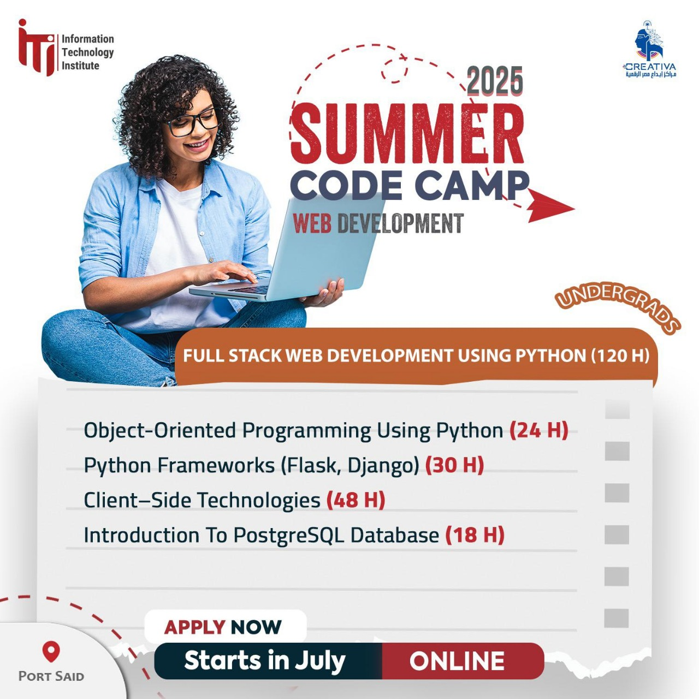

# 🌐 ITI Summer Code Camp 2025 – Full Stack Web Development (Port Said, Egypt)

This repository contains my work, notes, and solutions from the **ITI Summer Code Camp 2025**, held in Port Said, Egypt. The track focuses on full-stack web development using **Python** and modern client-side technologies.



## 📚 Course Details

- **Location:** Information Technology Institute (ITI), Port Said, Egypt
- **Mode:** Online
- **Duration:** July 2025
- **Total Hours:** 120

### 📌 Curriculum Breakdown

| Module                                   | Hours |
|------------------------------------------|-------|
| Object-Oriented Programming Using Python | 24 H  |
| Python Frameworks (Flask, Django)        | 30 H  |
| Client-Side Technologies (HTML, CSS, JS) | 48 H  |
| PostgreSQL Database                      | 18 H  |

---
## 📅 Course Tracker

🔗 [📝 ITI Summer Code Camp Task Tracker (Google Sheet)](https://docs.google.com/spreadsheets/d/1p48ETcN9bU6TGTF9KrZPx9M9-9bLXuqV/edit?gid=999122997#gid=999122997)


---
## 💻 Getting Started

To explore the content:

```bash
git clone https://github.com/your-username/iti-fullstack-course.git
